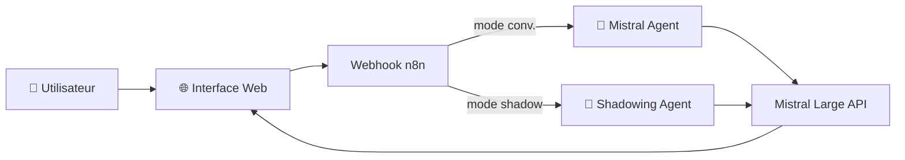

# 🎓 English Coach IA — n8n + Mistral

Application de coaching en anglais propulsée par l'IA Mistral. Deux modes : conversation guidée avec corrections et shadowing audio pour l'amélioration de la prononciation et de la fluidité.

## 🎯 Fonctionnalités

| Mode | Description |
|------|-------------|
| 💬 **Conversation** | Dialogue libre avec l'IA — corrections grammaticales, suggestions de vocabulaire, explications contextuelles |
| 🎤 **Shadowing** | Exercices de répétition audio — l'IA propose des phrases, tu répètes, elle corrige la prononciation |

## 🏗️ Architecture

## 🛠️ Stack

- **Orchestration** : n8n self-hosted
- **LLM** : Mistral AI (Mistral Large)
- **Interface** : HTML/CSS/JS servi directement par n8n (zéro dépendance frontend)
- **Accès** : Webhook HTTP — aucune installation requise côté utilisateur

## 📋 Workflows (4)

| Workflow | Rôle |
|----------|------|
| English Coach - Mistral Agent | Backend conversationnel — traitement des messages |
| English Coach - Serve HTML | Sert l'interface web du mode conversation |
| English Coach - Shadowing Agent | Backend shadowing — génération des exercices |
| English Coach - Serve HTML Shadowing | Sert l'interface web du mode shadowing |

## 📸 Captures d'écran

> *Screenshots à venir — interface conversation, exercice de shadowing*

## 🚀 Import dans n8n

1. Dans n8n → **Workflows** → **Import**
2. Importer les 4 JSON du dossier `workflows/`
3. Configurer le credential **Mistral AI**
4. Activer les 4 workflows
5. Accéder à l'interface via l'URL webhook du workflow "Serve HTML"

> 💡 L'interface est entièrement servie par n8n — pas besoin de serveur web séparé.
